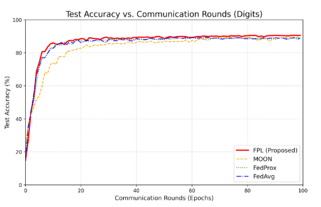
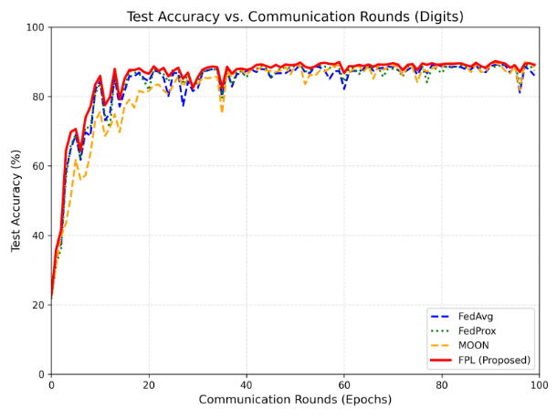

## Results

Using the dataset Digits I performmed two experiments and the results for them were as follows:
1. Full Participation (All Clients):
All 10 participants contributing in every round 100 epochs in my case.

### Highest Accuracy Achieved
This table shows the peak accuracy reached by each method across different datasets.

| Method | MNIST | USPS | SVHN | SYN | AVG | Epoch |
| :--- | :---: | :---: | :---: | :---: | :---: | :---: |
| **FedAvg** | 96.31 | 95.08 | 84.21 | 82.05 | 89.41 | 65 |
| **FedProx** | 96.57 | 94.98 | 83.56 | 81.93 | 89.26 | 60 |
| **MOON** | 95.50 | 93.90 | 89.24 | 80.44 | 89.77 | 96 |
| **FPL** | 97.00 | 95.42 | 86.30 | 83.61 | 90.58 | 97 |

### Final Accuracy (End of Training)
This table represents the final model performance after all communication rounds.

| Method | MNIST | USPS | SVHN | SYN | AVG |
| :--- | :---: | :---: | :---: | :---: | :---: |
| **FedAvg** | 95.85 | 94.38 | 83.76 | 81.83 | 88.96 |
| **FedProx** | 96.44 | 94.92 | 82.26 | 81.43 | 88.76 |
| **MOON** | 95.02 | 93.54 | 87.74 | 80.63 | 89.23 |
| **FPL** | 97.03 | 95.48 | 85.75 | 83.79 | 90.51 |

2. Partial Participation (Random Client Sampling)
Only a subset (5–6 clients) participate per round.

### Highest Accuracy
| Method | MNIST | USPS | SVHN | SYN | AVG | Epoch |
| :--- | :---: | :---: | :---: | :---: | :---: | :---: |
| **FedAvg** | 96.89 | 95.70 | 83.71 | 80.65 | 89.24 | 92 |
| **FedProx** | 96.32 | 94.72 | 85.10 | 80.65 | 89.20 | 93 |
| **MOON** | 96.80 | 95.36 | 87.74 | 79.58 | 89.87 | 97 |
| **FPL** | 96.59 | 95.06 | 84.65 | 84.48 | 90.20 | 91 |

### Final Accuracy
| Method | MNIST | USPS | SVHN | SYN | AVG |
| :--- | :---: | :---: | :---: | :---: | :---: |
| **FedAvg** | 90.13 | 90.28 | 84.38 | 79.37 | 86.04 |
| **FedProx** | 92.54 | 91.10 | 84.32 | 81.86 | 87.46 |
| **MOON** | 93.95 | 91.76 | 84.57 | 83.61 | 88.47 |
| **FPL** | 95.30 | 93.56 | 85.53 | 82.21 | 89.15 |

## Analysis

### 1. Performance under Full Participation

- When all clients participate in each communication round, FPL achieves the highest average accuracy (90.58% peak, 90.51% final), outperforming FedAvg, FedProx, and MOON
- FPL shows consistent improvement across all domains, especially on MNIST and USPS (high stability) and SYN (better domain generalization)
- Compared to FedAvg / FedProx, FPL improves average accuracy by ~1–1.5%, while MOON performs well on SVHN, it is less consistent across domains
- This indicates that prototype-based alignment helps learn a shared representation across heterogeneous domains, improving generalization

### 2. Performance under Partial Participation (Random Sampling)

- In a more realistic setting where only 5–6 clients participate per round All methods experience a drop in performance due to reduced communication, however, FPL remains the most robust method
- FPL achieves the highest final average accuracy (89.15%)
- It significantly outperforms:
  - FedAvg by ~3%
  - FedProx by ~1.7%
  - MOON by ~0.7%
- The performance gap increases compared to full participation, highlighting that FPL is more resilient to client sampling variability

For MNIST, USPS all methods perform well. While for SVHN, MOON is competitive due to contrastive learning, but FPL remains stable. In SYN FPL shows clear improvement, indicating better handling of domain shift.

